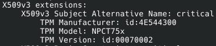

# tpm-trust


[](https://github.com/loicsikidi/tpm-trust/releases)
[](https://raw.githubusercontent.com/loicsikidi/tpm-trust/main/LICENSE)

A command-line tool to verify the authenticity of a TPM (Trusted Platform Module) by validating its Endorsement Key (EK) certificate against a trusted bundle of TPM manufacturer root certificates.

> [!IMPORTANT]
> This tool is in early stage and it's quite difficult to test it on various hardware.
> That's why I would highly appreciate any feedback from users, don't hesitate to open [issues](https://github.com/loicsikidi/tpm-trust/issues/new) if you encounter any problems or have suggestions!

## Motivation

This project demonstrates the utility of [tpm-ca-certificates](https://github.com/loicsikidi/tpm-ca-certificates), which provides a single bundle centralizing TPM manufacturer root certificates, making TPM validation straightforward and secure.

> [!NOTE]
> *If you want to know how security is ensured, please read [tpm-ca-certificates's core concepts](https://github.com/loicsikidi/tpm-ca-certificates/tree/main/docs#-core-concepts)*

## Primitives

- 📚 **Read-only TPM operations**: No writes to the TPM, purely verification
- ✅ **Latest EK Specifications**: Supports high-range handles and EK certificate chains
- 📜 **Uses `tpm-ca-certificates`**: Leverages native library features
  - Centralized trust roots provided by TPM manufacturers
  - Bundle integrity verification
  - Auto-update of the trust bundle
- 🔒 **Revocation Checking**: `tpm-trust` will by default check if a certificate in EK's chain has been revoked
- 🪶 **Zero Additional Dependencies**: install `tpm-trust` and you are ready to go!

## Demo


## Usage

<details>
<summary><b>Installation</b></summary>

### Using Go Install

```bash
go install github.com/loicsikidi/tpm-trust@latest
```

### From Source

```bash
git clone https://github.com/loicsikidi/tpm-trust.git
cd tpm-trust
go build -o tpm-trust
sudo mv tpm-trust /usr/local/bin/
```
### Using Nix

For reproducible, declarative installations, use Nix update your `shell.nix` with the following content:

```nix
{ pkgs ? import <nixpkgs> {} }:

let
  tpm-trust = import (fetchTarball "https://github.com/loicsikidi/tpm-trust/archive/main.tar.gz") {};
in
pkgs.mkShell {
  buildInputs = [
    tpm-trust
  ];
}
```

### On Arch Linux

tpm-trust is available in the [AUR](https://aur.archlinux.org/packages/tpm-trust-git) and can be installed with `paru -S tpm-trust-git`.

### Shell Completion

`tpm-trust` provides shell completion for bash, zsh, and fish. Enable it for a smoother experience:


**For bash:**
```bash
# Load completion for the current session
source <(tpm-trust completion bash)

# Add to your ~/.bashrc for persistent completion
echo 'source <(tpm-trust completion bash)' >> ~/.bashrc
```

**For zsh:**
```bash
# Load completion for the current session
source <(tpm-trust completion zsh)

# Add to your ~/.zshrc for persistent completion
echo 'source <(tpm-trust completion zsh)' >> ~/.zshrc
```

**For fish:**
```bash
# Load completion for the current session
tpm-trust completion fish | source

# Add to your fish config for persistent completion
tpm-trust completion fish > ~/.config/fish/completions/tpm-trust.fish
```

*Note: when installing via Nix, shell completions are automatically installed to the appropriate directories and should work out of the box.*
</details>

### Audit command

Verify your TPM's authenticity:

```bash
tpm-trust audit
```

> [!TIP]
> **Linux**: If TPM device needs privileged access, the CLI will automatically ask for elevated permissions using sudo 💫.
>
> **Windows**: You must run the CLI from an administrator terminal (Run as Administrator) to access the TPM device.

#### Skip Revocation Check

If CRL endpoints are unavailable or you want to skip revocation checking:

```bash
tpm-trust audit --skip-revocation-check
```

#### Verbose Output

Enable detailed logging to see each validation step:

```bash
tpm-trust audit --verbose
```

#### Exit Codes

- `0`: TPM is trusted and verification succeeded
- `1`: TPM is not trusted or validation failed

### Info command

Display TPM information (manufacturer, model, firmware, supported key types, etc.):

```bash
tpm-trust info
```

### Certificates commands

List available key types:

```bash
tpm-trust certificates list
```

Get certificate details for a specific key type:

```bash
tpm-trust certificates get $KTY
```

Display EK certificate chains stored in TPM NVRAM:

```bash
tpm-trust certificates bundle
```

### Version command

```bash
tpm-trust version
```

## Requirements

- **Platform**: Linux or Windows with TPM 2.0
  - **Linux**: Privileged access will be requested automatically via sudo if needed
  - **Windows**: Must be run from an administrator terminal (Run as Administrator)
- **Internet Connection** (for initial setup):
  - Download and verify the trust bundle from `tpm-ca-certificates`
  - Fetch CRLs (if revocation checking is enabled)
  - Download intermediate certificates (if needed)

## Tested TPM Hardware

The following TPM devices have been successfully verified using `tpm-trust audit`:

| Manufacturer | Model | Revision | Firmware |
|-------------|-------|----------|----------|
| Nuvoton Technology (NTC) | NPCT75x | 1.59 | 7.2 |

> [!NOTE]
> If you've successfully verified your TPM with `tpm-trust` and don't see your hardware in the table above, please consider creating a PR to add it!
>
> <details>
> <summary><b>How to find your TPM information</b></summary>
>
> To add your TPM to this list, follow these steps:
>
> 1. **List available key types**:
>    ```bash
>    tpm-trust certificates list
>    ```
>    This will show the available key types (kty) on your TPM (e.g., `rsa-2048`, `ecc-nist-p384`).
>
> 2. **List certificates for a specific key type**:
>    ```bash
>    tpm-trust certificates get <kty>
>    ```
>    Replace `<kty>` with one of the key types from step 1 (e.g., `tpm-trust certificates get rsa-2048`).
>
> 3. **Find the TPM Model from the SAN (Subject Alternative Name)**:
>
>    In the certificate output, look for the `X509v3 Subject Alternative Name` section:
>
>    
>
>    The `TPM Model` field contains your TPM model (e.g., `NPCT75x`).
>
> 4. **Get manufacturer, revision, and firmware**:
>    ```bash
>    tpm-trust info
>    ```
>    This command will display the manufacturer name, revision, and firmware version.
>
> </details>

## Known Limitations

- **Platform Support**: Only TPM 2.0 is currently supported
  - I don't plan to support TPM 1.2 as it's largely obsolete
- `tpm-ca-certificates` currently only supports a limited set of TPM manufacturers. Check its documentation [here](https://github.com/loicsikidi/tpm-ca-certificates/tree/main/src#vendor-index) for the latest supported vendors.
  * If you need support for a specific TPM manufacturer, please open [an issue](https://github.com/loicsikidi/tpm-ca-certificates/issues/new) in the `tpm-ca-certificates` repository.

> [!TIP]
> You won't need to update `tpm-trust` to get newest bundle version.
>
> *Why?* Internally, `tpm-trust` uses `tpm-ca-certificates` library to always get the latest trust bundle.

## Dependency Update Policy

> [!NOTE]
> For those interested in understanding the motivations behind this approach, I recommend reading [Filippo Valsorda's thoughts on Dependabot](https://words.filippo.io/dependabot/).

This project does not rely on automated dependency update tools like Dependabot. When managing multiple projects in parallel, such tools generate more noise than value.

Instead, this project follows a pragmatic, security-first approach:

1. **`govulncheck` runs daily** to detect vulnerable dependencies. When a vulnerability is identified → we bump the affected dependency.
2. **Feature-driven updates**: Dependencies are updated when the project needs a new feature or capability provided by a newer version.

This approach balances security with intentionality, ensuring updates happen for concrete reasons rather than on autopilot.

## Development

### Prerequisites

```bash
nix-shell
```

This will set up a development environment with all required dependencies.

> [!TIP]
> This will also add git hooks thanks to [git-hooks.nix](https://github.com/cachix/git-hooks.nix).

### Building

```bash
go build -o tpm-trust
```

### Testing

```bash
# alias provided by nix-shell
gotest
```

### Lint

```bash
# alias provided by nix-shell
lint
```

## License

See [LICENSE](LICENSE) file for details.
